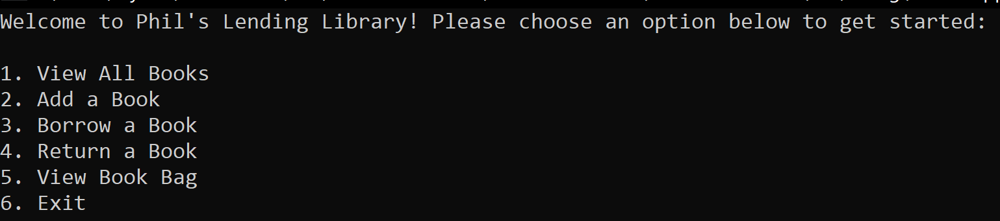
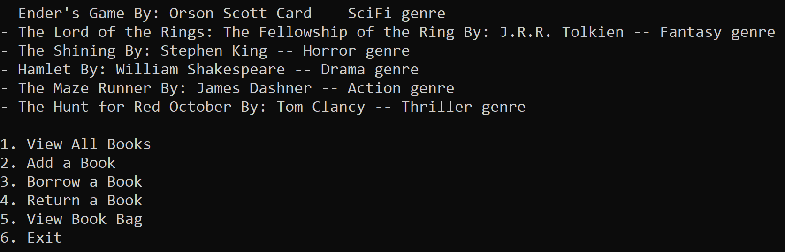
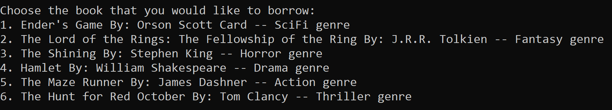

# Lab 08 Collections

*Author: Peyton Cysewski*

----

## Description
This console app mimics an interaction a patron might have with a lending library. Books can be added to the library, then the user can choose to view the collection of books. If they like one, they can choose to borrow it and store it in their book bag. Here they can view what books they are currently borrowing. Once they are done with the book they can choose to return it to the library. It has a simple user interface with options for each of these actions or to exit the application.

---

### Getting Started
Clone this repository to your local machine.

```
$ git clone https://github.com/Peyton-Cysewski/Lab08-Collections.git
```

### To run the program from Visual Studio:
Select ```File``` -> ```Open``` -> ```Project/Solution```

Next navigate to the location you cloned the Repository.

Double click on the ```Lab08-Collections``` directory.

Then select and open ```Lab08-Collections.sln```

---

### Visuals

#### Application Start

#### Using the Application

#### Application End


---

### Change Log
1.1: *Initial Release* - 15 July 2020  


------------------------------